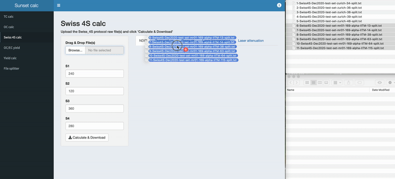
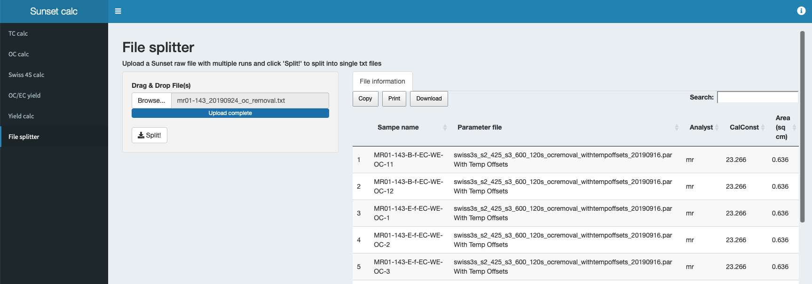

<h2 align="center">Sunset-calc</h2>

<h4 align="center">Analyse OC/EC data</h4>

## Overview

Sunset-calc is a [R shiny app](https://shiny.rstudio.com) to calculate the amount of carbon for TC, Swiss_3S, and Swiss4S protocols from raw files recorded using a commercial thermo-optical OC/EC analyser (Model 5L, [Sunset Laboratory Inc.](https://www.sunlab.com), OR, United States). You can also calculate the EC recovery after WINSOC removal (EC yield) with the Swiss_3S protocol. The 'OC/EC yield' gives you all the amounts, yield, and charring for OC and EC. You can upload one or multiple files, however, **each file must contain only one Sunset run**. If you have multiple runs in a single txt file, please use the 'file splitter' first.

### TC calc

Program to calculate TC for TC files. You get a .zip file containing a .csv file with the amount of carbon (µg C) for each step and the total carbon as well as the name of the sample corresponding to the input file name. If you compare the OC calc result to a result calculated by another software, be aware of the filter area that you used.

### OC calc

Program to calculate S1, S2, and S3 OC and total for Sunset OC-removal (Swiss_3S) files. See [Zhang et al.  (2012)](https://doi.org/10.5194/acp-12-10841-2012) for details. If you use a modified protocol, you need to adjust the set time in seconds for each modified step. Please do not adjust the times if you don't know what you are doing. When you reload the app, the times will go back to the default value, which corresponds to the standard Swiss_3S. You get a .zip file containing a .csv file with the amount of carbon (µg C) for each step and the total carbon as well as the name of the sample corresponding to the input file name. If you compare the OC calc result to a result calculated by another software, be aware of the filter area that you used.

### Swiss 4S calc

Program to calculate S1, S2, S3, S4, and total for Swiss_4S files. The calculation is basically the same as the OC calc for Swiss_3S, however, it is adjusted for the additional (EC) step at the end.

### OC/EC yield

Program to calculate the amount of carbon in S1, S2, S3, and total amout of carbon in OC (Swiss_3S file). The amount of EC is calculated with the uploaded EC file. Additionally, the EC yield and charring is calculated using the Swiss_3S file. The result from each calculation is then used to perform the amount correction.

### Yield calc

This app calculates the EC yield and charring for one or multiple OC removal runs with the Swiss_3S protocol. This app is useful for the optimisation (time, temperature) of the OC/EC separtion. Frequently, you will need perform the OC removal on multiple filters cuts to get enough EC for a radiocarbon measurement. Yield calc calculates EC yield and charring, removes potential outliers and gives you the result you need. A generic file is used for laser signal correction. Optionally, you can upload your own file (TC, EC, or Swiss_4S) for temperature dependent laser signal correction. 

You will get a zip folder containing five files:

 File name | File extension | Description |
 --------------- | --------------- | --------------- |
 mean-result | csv | Mean results when multiple files were uploaded
 raw-result | csv | EC yield and charring from all uploaded filters |
 clean-result | csv| EC yield and charring results without outliers|
 stat-result | csv | Statistics |
 yield-calc-summary | pdf | Summary pdf with boxplots for EC yield and charring and summary table |

### File splitter

The file splitter splits a Sunset txt raw file with multiple runs in one to multiple files with one run. The app is no-frills; upload the file and get a zip file with each run in a single txt file. Result txt file nomenclature: [sample number]-[file name]-[sample name]-split.txt   Additional to splitting files, the file splitter also shows you a table with some relevant information regarding each file in a table, which you can copy and download.

## How does it work?

The *Sunset calc* app is made with [shinydashboard](https://rstudio.github.io/shinydashboard/), which contains the apps *TC calc*, *OC calc*, *Swiss 4S calc*, *OC/EC yield*, and *Yield calc* linked in the sidebar. Additionally, there is a *file splitter* app in the sidebar. The plots immediately shown after file upload are generated independently from the calculation in the app, the calculation takes place in a linked R script and is triggered by pressing the 'Calculate & Download' button. A busy indicator made with [shinybusy](https://dreamrs.github.io/shinybusy/) appears when the server is busy. 

### Calculation

#### Calibration coefficients and calibration constant

First, the coefficients from NDIR calibration are calculated. The amount reflects the known amount of analyte (sucrose solution) added, the area is the calculated area with the code below. Please be aware that the values storred file are valid for the Sunset device at [LARA](https://www.14c.unibe.ch) and might be significantly different on an other device. The csv file is imported is assigned the variable `NDIR_calib`. A linear regression model using the lm() function is made and the coefficients stored to the variable `coef`. Using the coefficients, the `currentCalConstant` is calculated. This CalConstant is later used to for correction should the sample have used a different calibration constant (e.g. when measuring online with GIS/MICADAS). Initially, the calculated intercept was used, however, trials showed that the results match the Sunset Calc426 (program provided by Sunset for analysis) better when the intercept was set to zero.

    # calculation of coefficients from NDIR calibration, intercept set to zero
    NDIR_calib <- read.csv("NDIR-integrals-20200224-offline.csv", header = T)
    intercept <- 0
    calib <- lm(I(area - intercept) ~ 0+ amount, data = NDIR_calib)
    coef <- as.data.frame(calib$coefficients)
    coef <- rbind(intercept, as.data.frame(calib$coefficients))
    currentCalConstant <<- (mean(NDIR_calib$CH4.area)-coef[1,])/coef[2,]

#### Calculation function

The uploaded Sunset raw file is imported to a data frame, a new column for time added and all unnecessary columns except `time_s` and `CO2_ppm` removed.

      df <-  as.data.frame(read.csv(file = filename, sep = ",", skip = 28, header = T ))
      df$time_s <- seq(1:length(df$CO2_ppm))
      df <-df[,c(21,16)]

A baseline correction is then performed:

      df$CO2_ppm <- df$CO2_ppm-median(sort(df$CO2_ppm,decreasing=F)[1:length(which(df$CO2_ppm < 0))])
      df$CO2_ppm[df$CO2_ppm < 0] <- 0

The calibration constant (`CalConstant`) value is imported from the file and the calibration constant factor (`CalConstFactor`) calculated. The `CalConstant` in a file could be different due to a new calibration, an old file, or an online measurement. Online measurements are different due to a different back pressure to the NDIR. Pressure as well as temperature affect CO2 measurements with NDIR ([Yasuda et al., 2012](https://doi.org/10.3390/s120303641)).

      CalConstant <-  as.data.frame(read.csv(file = filename, sep = ",", skip = 18, header = F ))
      CalConstant <- as.numeric(CalConstant[1,1])
      CalConstFactor <- CalConstant/currentCalConstant

The local regression model is made, the CH4 area integrated and with that the `calibration_peak_correction_factor` calculated. Finally, the TC area is integrated and corrected with the calibration peak correction factor. Then, the amount in µg C is calculated using the calibration coefficients and corrected with the `CalConstFactor`.

      colnames(df) = c("x", "y")
      model<-loess(y~x, span=0.05, data=df)
      mod.fun<-function(x) predict(model,newdata=x)

The script is shown for TC, but works in a similar fashion for OC and Swiss 4S. 

    #CH4 correction
      CH4_area <- integrate(mod.fun,280,380)

    #calibration peak correction factor with CH4
      calibration_peak_correction_factor <- mean(NDIR_calib$CH4.area)/CH4_area$value 

    #Calculate area for each peak and total
    #total carbon
      total_area <- integrate(mod.fun,50,250)
      total_area <- total_area$value*calibration_peak_correction_factor
      amount.tc <- (total_area-coef[1,])/coef[2,]
      amount.tc <<- amount.tc*CalConstFactor

The calculation code from above was wrapped into a function:

      data.load.func = function(filename) {
    #code from above here
    } 

This function is executed for each uploaded file:

      filename <- input$fileUploaded$datapath
    #file name for output
      filename.text <<- input$fileUploaded$name

      df.amount <- NULL
      for (i in filename){
      data.load.func(i)
      df.amount <- rbind(df.amount, data.frame(amount.tc))
    }

    # combine file name with ouput data
      df.amount <- cbind(filename.text,df.amount)
      colnames(df.amount) <- c("sample name","TC (ug C)")
      df.amount

The resulting `df.amount` is handled back to the shiny app for output.

### File splitter

The file splitter is simple: The file with multiple Sunset runs is uploaded, the script looks for the keyword _Sample_, with which every Sunset raw data file starts and splits into individual .txt files. Therefore, even when Sunset runs with different lengths are performed (e.g., TC followed by Swiss_4S), the files are split correctly into individual .txt files. 

### OC/EC yield

The server side of the `oc_ec_yield_app.R` contains the following script:

        #run yields calc, oc-calc, and tc calc, then return the desired data
        source("yields_calc_shiny.R", local = TRUE)
        source("oc_calc_shiny.R", local = TRUE)
        source("tc_calc_shiny.R", local = TRUE)
        return(list(df.yield=df_raw, df.amount.oc=df.amount.oc, df.amount.tc=df.amount.tc))

As soon as the user presses the 'Calculate & Download' button, the uploaded OC data is run with the `yields_calc_shiny.R` and `oc_calc_shiny.R` script and the EC data is run in the `tc_calc_shiny.R` script. the return call gives the results from each calculation. The results are stored in the new data frame `df.result`. Using this data frame, the corrected OC and EC amounts are calculated. `TCcalculated` is the sum of OC and EC, `ECcorr` is the EC yield corrected amount of EC, and `OCcorr` is the EC yield corrected amount of OC. Finally, the data frame is sorted and column names applied.

The exported csv file contains the sample name for both the OC file as well as the EC file to avoid mistakes before EC yield and charring results as well as the raw and calculated amount of carbon for each fraction. 

## About Sunset-calc

### Info

This app was created by [Martin Rauber](https://martin-rauber.com) for [LARA](https://www.14c.unibe.ch), the Laboratory for the Analysis of Radiocarbon with AMS at the University of Bern. The EC yield calculation script is part of [COMPYCALC](https://doi.org/10.5281/zenodo.4318834) and adapted from there. Sunset calc is available online: [14c.unibe.ch/sunsetcalc](https://www.14c.unibe.ch/sunsetcalc). Please get in touch for any bug fixes and suggestions!

### License

Sunset-calc is released under the [MIT License](./LICENCE.txt).
