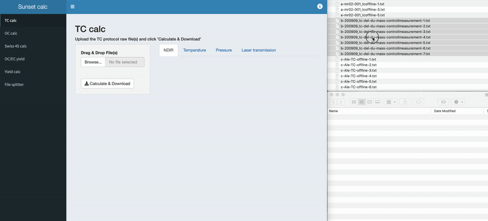

# Readme

## Overview
The sunset-calc program is a [R shiny app](https://shiny.rstudio.com) to calculate the amount of carbon for TC and Swiss_3S protocols from raw files recorded using a commercial thermo-optical OC/EC analyzer (Model 5L, [Sunset Laboratory Inc.](https://www.sunlab.com), OR, United States). Be aware that this app only works with the designated Sunset protocols. You can upload one or multiple files, however, **each file must contain only one Sunset run**. Expected file size for TC files are ~48 KB and ~140 KB for OC (Swiss_3S) files. If you have multiple runs in a single txt file, please use the 'file splitter' first. 

## TC calc

Program to calculate TC for TC files. You get a .zip file containing a .csv file with the amount of carbon (µg C) for each step and the total carbon as well as the name of the sample corresponding to the input file name. 
If you compare the OC calc result to a result calculated by another software, be aware of the filter area that you used.



## OC calc

Program to calculate S1, S2, and S3 OC and total for Sunset OC-removal (Swiss_3S) files. See [Zhang et al., 2012](https://doi.org/10.5194/acp-12-10841-2012) for details. If you use a modified protocol, you need to adjust the set time in seconds for each modified step. Please do not adjust the times if you don't know what you are doing. When you reload the app, the times will go back to the default value, which corresponds to the standard Swiss_3S.
You get a .zip file containing a .csv file with the amount of carbon (µg C) for each step and the total carbon as well as the name of the sample corresponding to the input file name. 
If you compare the OC calc result to a result calculated by another software, be aware of the filter area that you used.


## Swiss 4S calc

Program to calculate S1, S2, and S3 OC and total OC for Swiss_4S files, basically the same as the OC calc for Swiss_3S but adjusted for the additional protocol step.

## EUSAAR2 calc
 
Proposed program to calculate OC/EC EUSAAR2 files… under construction

## OC/EC yield 

Program to calculate the amount in S1, S2, S3, and total OC (Swiss_3S file) using the OC calc script. The amount of EC is calculated with the uploaded EC file using the TC calc script. Additionally, the EC yield and charring is calculated using the Swiss_3S file. The result from each calculation is then used to perform the EC-yield correction. 

## File splitter

The file splitter splits a Sunset txt raw file with multiple runs in one to multiple files with one run. The app is no-frills; upload the file and get a zip file with each run in a single txt file. Result txt file nomenclature: [sample number]-[file name]-[sample name]-split.txt 


## Issues

For OC calc and Swiss 4S calc, the sum of each step (S1,S2,…) is not equal to the total, which is made by integrating from  start to end. 

## How does it work?

The *Sunset calc* app is made with [shinydashboard](https://rstudio.github.io/shinydashboard/), which contains the two very similar but fully self functioning apps *TC calc* and *OC calc* linked in the sidebar. Additionally, there is a *file splitter* app in the sidebar and this *readme* markdown file you are reading right now for information. The plots immediately shown after file upload are generated independently from the calculation in the app, the calculation takes place in a linked R script and is triggered by pressing the 'Calculate & Download' button. After calculation, the result data frame is handled back to the shiny app, which creates a csv file and wraps this into a zip file for download.

### Calculation

#### Calibration coefficients and calibration constant

First, the coefficients from NDIR calibration are calculated. The amount reflects the known amount of analyte (sucrose solution) added, the area is the calculated area with the code below. Please be aware that the values storred file are valid for the Sunset device at [LARA](https://www.14c.unibe.ch) and might be significantly different on an other device. The csv file is imported is assigned  the variable `NDIR_calib`. A linear regression model using the lm() function is made and the coefficients stored to the variable `coef`. Using the coefficients, the `currentCalConstant` is calculated. This CalConstant is later used to for correction should the sample have used a different calibration constant (e.g. when measuring online with GIS/MICADAS). <br>
```
  NDIR_calib <- read.csv("NDIR-integrals-20200224-offline.csv", header = T)
  calib <- lm(area~amount, data = NDIR_calib)
  coef <- as.data.frame(calib$coefficients)
  currentCalConstant <<- (mean(NDIR_calib$CH4.area)-coef[1,])/coef[2,]
```
#### Calculation function

The uploaded Sunset raw file is imported to a data frame, a new column for time added and all unnecessary columns except `time_s` and `CO2_ppm` removed. 

```
  df <-  as.data.frame(read.csv(file = filename, sep = ",", skip = 28, header = T ))
  df$time_s <- seq(1:length(df$CO2_ppm))
  df <-df[,c(21,16)]
```

A baseline correction with the 20 smallest values is then performed: 

```
  df$CO2_ppm <- df$CO2_ppm-mean(sort(df$CO2_ppm,decreasing=F)[1:20])
```

The calibration constant (`CalConstant`) value is imported from the file and the calibration constant factor (`CalConstFactor`) calculated. The `CalConstant` in a file could be different due to a new calibration, an old file, or an online measurement. Online measurements are different due to a different back pressure to the NDIR. Pressure as well as temperature affect CO<sub>2</sub> measurements with NDIR ([Yasuda et al., 2012](https://doi.org/10.3390/s120303641)).

```
  CalConstant <-  as.data.frame(read.csv(file = filename, sep = ",", skip = 18, header = F ))
  CalConstant <- as.numeric(CalConstant[1,1])
  CalConstFactor <- CalConstant/currentCalConstant
```
  
The local regression model is made, the CH<sub>4</sub> area integrated and with that the `calibration_peak_correction_factor` calculated. Finally, the TC area is integrated and corrected with the calibration peak correction factor. Then, the amount in µg C is calculated using the calibration coefficients and corrected with the `CalConstFactor`.
  
``` 
  colnames(df) = c("x", "y")
  model<-loess(y~x, span=0.05, data=df)
  mod.fun<-function(x) predict(model,newdata=x)

```

The shown script is valid for both TC and OC calculation, only the following section is different:

#### TC

```

#CH4 correction
  CH4_area <- integrate(mod.fun,280,380)

#calibration peak correction factor with CH4
  calibration_peak_correction_factor <- mean(NDIR_calib$CH4.area)/CH4_area$value 

#Calculate area for each peak and total
#total carbon
  total_area <- integrate(mod.fun,50,250)
  total_area <- total_area$value*calibration_peak_correction_factor
  amount.tc <- (total_area-coef[1,])/coef[2,]
  amount.tc <<- amount.tc*CalConstFactor
```

#### OC

```
#total protocol length
  total.length <- length(df$x)
  
  #CH4 corrections
  CH4_area <- integrate(mod.fun,total.length-140,total.length)
  
  #calibration peak correction factor with CH4
  calibration_peak_correction_factor <- mean(NDIR_calib$CH4.area)/CH4_area$value 

  #Calculate area for each peak and total. Standard integration S1 50-350, S2 350-610, S3 610-1050, CH4 1050-1190
  #OC S1
  OC_areaS1 <- integrate(mod.fun,50,S1_length)
  OC_areaS1 <- OC_areaS1$value*calibration_peak_correction_factor
  amount.S1 <- (OC_areaS1-coef[1,])/coef[2,]
  amount.S1 <<- amount.S1*CalConstFactor
  #OC S2
  OC_areaS2 <- integrate(mod.fun,S1_length,S2_length)
  OC_areaS2 <- OC_areaS2$value*calibration_peak_correction_factor
  amount.S2 <- (OC_areaS2-coef[1,])/coef[2,]
  amount.S2 <<- amount.S2*CalConstFactor
  #OC S3
  OC_areaS3 <- integrate(mod.fun,S2_length,S3_length)
  OC_areaS3 <- OC_areaS3$value*calibration_peak_correction_factor
  amount.S3 <- (OC_areaS3-coef[1,])/coef[2,]
  amount.S3 <<- amount.S3*CalConstFactor
  #total carbon
  total_area <- integrate(mod.fun,50,total.length-140)
  total_area <- total_area$value*calibration_peak_correction_factor
  amount.tc <- (total_area-coef[1,])/coef[2,]
  amount.tc <<- amount.tc*CalConstFactor
```

The calculation code from above was wrapped into a function:

```
  data.load.func = function(filename) {
#code from above here
} 
```

This function is executed for each uploaded file:

#### TC

```
  filename <- input$fileUploaded$datapath
#file name for output
  filename.text <<- input$fileUploaded$name

  df.amount <- NULL
  for (i in filename){
  data.load.func(i)
  df.amount <- rbind(df.amount, data.frame(amount.tc))
}

# combine file name with ouput data
  df.amount <- cbind(filename.text,df.amount)
  colnames(df.amount) <- c("sample name","TC (ug C)")
  df.amount
```

#### OC

```
#get file name
  filename <- input$fileUploaded$datapath
#file name for output
  filename.text <<- input$fileUploaded$name
#length of 
  S1_length <<- (110+as.numeric(input$inTextS1))
  S2_length <<- (490+as.numeric(input$inTextS2))
  S3_length <<- (690+as.numeric(input$inTextS3))

#create an empty df
  df.amount <- NULL
#loop function
  for (i in filename){
  data.load.func(i)
  df.amount <- rbind(df.amount, data.frame(amount.S1, amount.S2, amount.S3,amount.tc))
}

# combine file name with ouput data
  df.amount <- cbind(filename.text,df.amount)
  colnames(df.amount) <- c("sample name","S1 (ug C)","S2 (ug C)","S3 (ug C)", "total (ug C)")
  df.amount
```

The resulting `df.amount` is handled back to the shiny app for output. 

### File splitter

The file splitter is very simple and consists of three sections: 

#### import

```
#get the filename
  filename.long <- input$fileUploaded$name
#shortened filename without txt extension
  filename.short <- str_sub(filename.long, end=-5)
#get the file datapath
  filedatapath <- input$fileUploaded$datapath   
#read file in df
  df.head <- (read_csv(file = filedatapath, skip = 28))[1,]
#create colnames
  df.colnames <- colnames(df.head, do.NULL = TRUE, prefix = "col")
#read the the file
  df <- read_csv(file = filedatapath, col_names =  df.colnames)
#get the index of each row which contains the word "Sample"
  df.rowindex.newfile <- which(df$FID1=="Sample",arr.ind=T)
# subset to get the sample name
  df.samplename <- df[(df.rowindex.newfile+1),1]
#get row index of for the end of the file:
  df.rowindex.endfile <- c((df.rowindex.newfile[2:length(df.rowindex.newfile)])-1,length(df$FID1))
```

#### split

```
#split df and save as txt
  for (i in seq(1:length(df.rowindex.newfile))) {
    write.csv(df[df.rowindex.newfile[i]:df.rowindex.endfile[i],], row.names=FALSE, quote=FALSE, file = paste0(i,"-",   filename.short,"-", df.samplename[i,],"-split",".txt"))
      }
```

#### output

```
#create a list of txt files
  file.list <- paste(list.files(getwd(), pattern = "*-split*.txt"), sep = "")
#make zip file
  zip(zipfile=fname, files=file.list)
#remove the created files
  file.remove(file.list)
```

## About Sunset calc

### Feature wish list

- test whether a pressure dependent calculation needs to be implemented, especially for online files

### Repository

The source code is available on [Github](https://github.com/martin-rauber/sunset-calc).

### Info

This app was created by [Martin Rauber](https://martin-rauber.com) for LARA, the Laboratory for the Analysis of Radiocarbon with AMS at the University of Bern. It's available online on [shinyapps.io](http://martinrauber.shinyapps.io/sunset-calc/) with the specific LARA NDIR values for testing purposes. Please get in touch for any bug fixes and suggestions!


